# Inteligencia Artificial
## 1. Fundamentos de la Inteligencia Artificial

### 1.1 Definición y alcance

La **Inteligencia Artificial (IA)** es la capacidad de las máquinas para realizar tareas que normalmente requieren inteligencia humana.

Existen dos tipos principales:

- **IA débil**: Sistemas especializados en tareas específicas (como Siri o Google Translate)
- **IA fuerte**: Sistemas con inteligencia general como los humanos (aún no existe)

### 1.2 Tipos de IA

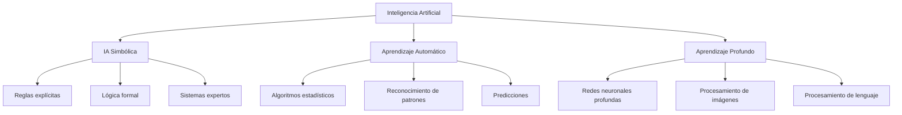
```mermaid
graph TD
    A[Inteligencia Artificial] --> B[IA Simbólica]
    A --> C[Aprendizaje Automático]
    A --> D[Aprendizaje Profundo]
    
    B --> B1[Reglas explícitas]
    B --> B2[Lógica formal]
    B --> B3[Sistemas expertos]
    
    C --> C1[Algoritmos estadísticos]
    C --> C2[Reconocimiento de patrones]
    C --> C3[Predicciones]
    
    D --> D1[Redes neuronales profundas]
    D --> D2[Procesamiento de imágenes]
    D --> D3[Procesamiento de lenguaje]
```

**Enlaces para profundizar:**

- [Que es la Inteligencia Artificial](https://www.ibm.com/cloud/learn/what-is-artificial-intelligence)

---

## 2. Aprendizaje Automático y Aprendizaje Profundo

### 2.1 Aprendizaje supervisado, no supervisado y por refuerzo

El aprendizaje automático es como enseñar a un niño, pero con datos:

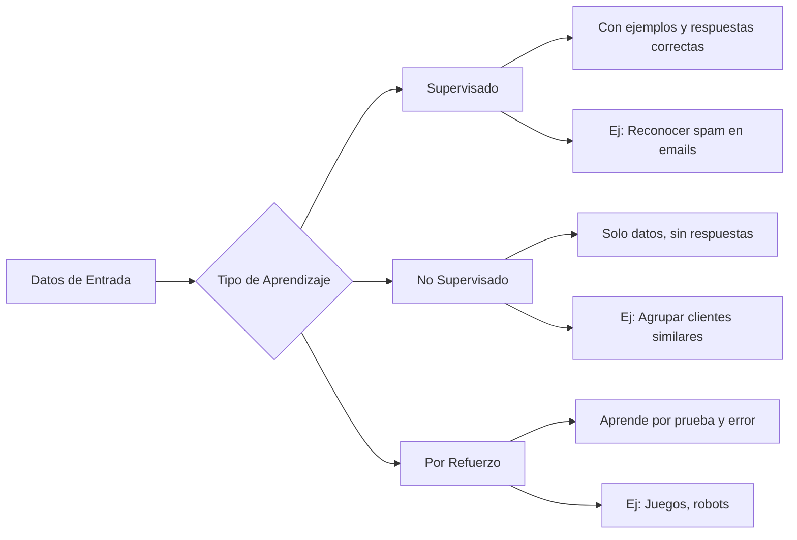
```mermaid
graph LR
    A[Datos de Entrada] --> B{Tipo de Aprendizaje}
    
    B --> C[Supervisado]
    B --> D[No Supervisado]
    B --> E[Por Refuerzo]
    
    C --> C1[Con ejemplos y respuestas correctas]
    C --> C2[Ej: Reconocer spam en emails]
    
    D --> D1[Solo datos, sin respuestas]
    D --> D2[Ej: Agrupar clientes similares]
    
    E --> E1[Aprende por prueba y error]
    E --> E2[Ej: Juegos, robots]
```

### 2.2 Redes neuronales básicas

Una red neuronal artificial imita cómo funciona nuestro cerebro:

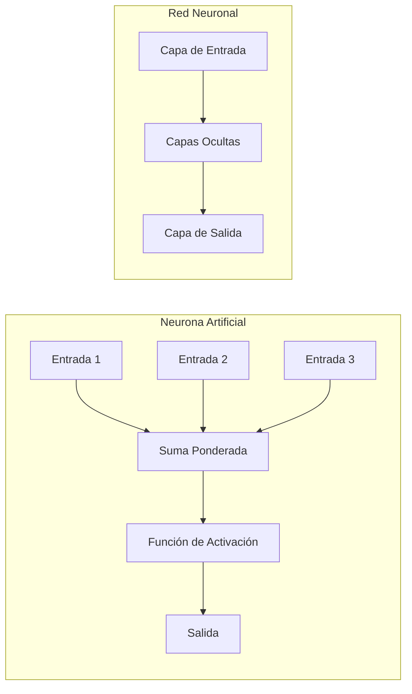
```mermaid
graph LR
    subgraph "Neurona Artificial"
        A[Entrada 1] --> D[Suma Ponderada]
        B[Entrada 2] --> D
        C[Entrada 3] --> D
        D --> E[Función de Activación]
        E --> F[Salida]
    end
    
    subgraph "Red Neuronal"
        G[Capa de Entrada] --> H[Capas Ocultas]
        H --> I[Capa de Salida]
    end
```

### 2.3 Arquitecturas avanzadas

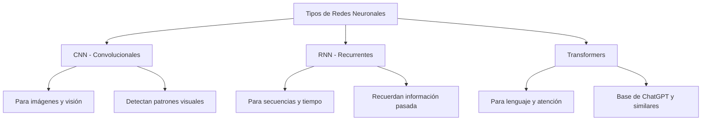
```mermaid
graph TD
    A[Tipos de Redes Neuronales] --> B[CNN - Convolucionales]
    A --> C[RNN - Recurrentes]
    A --> D[Transformers]
    
    B --> B1[Para imágenes y visión]
    B --> B2[Detectan patrones visuales]
    
    C --> C1[Para secuencias y tiempo]
    C --> C2[Recuerdan información pasada]
    
    D --> D1[Para lenguaje y atención]
    D --> D2[Base de ChatGPT y similares]
```

**Enlaces**

- [Introducción al Machine Learning - Coursera](https://www.coursera.org/learn/machine-learning)
- [Redes Neuronales Explicadas - 3Blue1Brown](https://www.3blue1brown.com/topics/neural-networks)
- [Deep Learning Book - Ian Goodfellow](https://www.deeplearningbook.org/)

---

## 3. Modelos de Lenguaje a Gran Escala (LLMs)

### 3.1 ¿Qué es un LLM?

Un **Modelo de Lenguaje a Gran Escala (LLM)** es como un bibliotecario súper inteligente que ha leído millones de libros y puede conversar sobre cualquier tema. Ejemplos: ChatGPT, Claude, Bard.

### 3.2 Arquitectura de Transformers

Los Transformers son el "cerebro" detrás de los LLMs modernos:

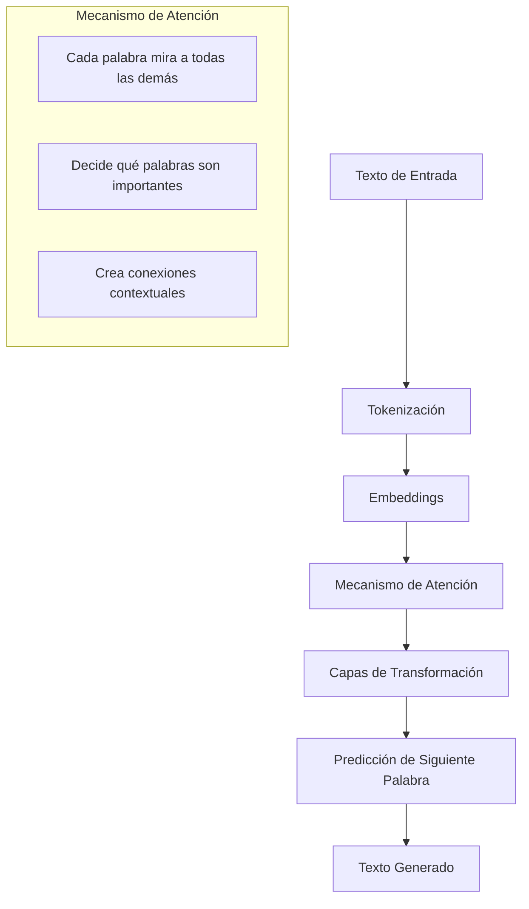
```mermaid
graph TB
    A[Texto de Entrada] --> B[Tokenización]
    B --> C[Embeddings]
    C --> D[Mecanismo de Atención]
    D --> E[Capas de Transformación]
    E --> F[Predicción de Siguiente Palabra]
    F --> G[Texto Generado]
    
    subgraph "Mecanismo de Atención"
        H[Cada palabra mira a todas las demás]
        I[Decide qué palabras son importantes]
        J[Crea conexiones contextuales]
    end
```

#### Tipos de Transformers:

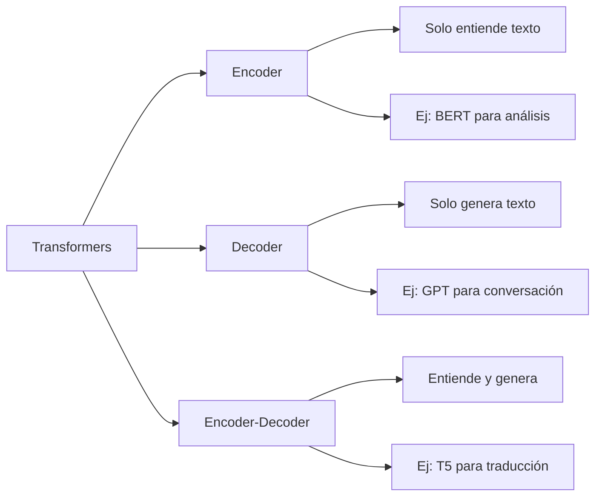
```mermaid
graph LR
    A[Transformers] --> B[Encoder]
    A --> C[Decoder]
    A --> D[Encoder-Decoder]
    
    B --> B1[Solo entiende texto]
    B --> B2[Ej: BERT para análisis]
    
    C --> C1[Solo genera texto]
    C --> C2[Ej: GPT para conversación]
    
    D --> D1[Entiende y genera]
    D --> D2[Ej: T5 para traducción]
```

### 3.3 Pre-entrenamiento y ajuste fino

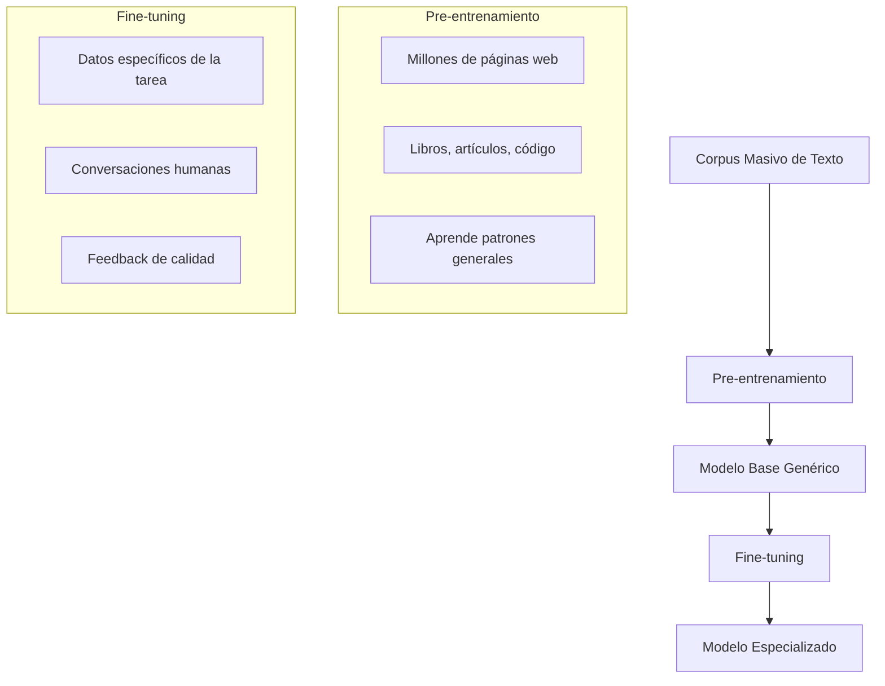
```mermaid
flowchart TD
    A[Corpus Masivo de Texto] --> B[Pre-entrenamiento]
    B --> C[Modelo Base Genérico]
    C --> D[Fine-tuning]
    D --> E[Modelo Especializado]
    
    subgraph "Pre-entrenamiento"
        F[Millones de páginas web]
        G[Libros, artículos, código]
        H[Aprende patrones generales]
    end
    
    subgraph "Fine-tuning"
        I[Datos específicos de la tarea]
        J[Conversaciones humanas]
        K[Feedback de calidad]
    end
```

**Enlaces**
- [LLMs](https://www.ibm.com/mx-es/think/topics/large-language-models)
- [Como se entrenan](https://es.shaip.com/blog/a-guide-large-language-model-llm/)

---

## 4. Tokenización y Representación de Texto

### 4.1 ¿Qué es un token?

Un **token** es como dividir una frase en piezas que la computadora puede entender. Es similar a cortar una pizza en rebanadas.

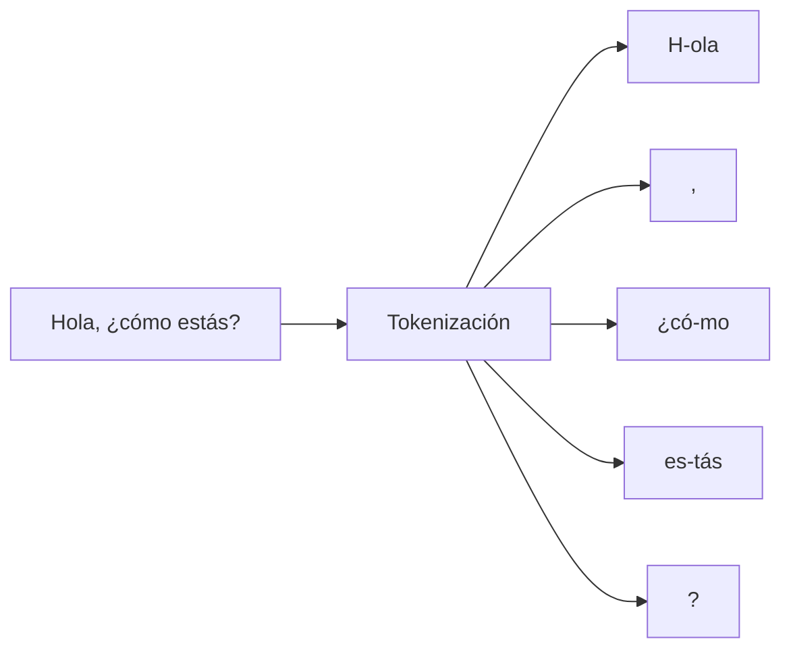
```mermaid
graph LR
    A["Hola, ¿cómo estás?"] --> B[Tokenización]
    B --> C[H-ola]
    B --> D[,]
    B --> E[¿có-mo]
    B --> F[es-tás]
    B --> G[?]
```

### 4.2 Métodos de tokenización

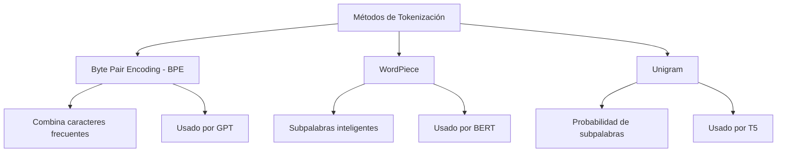
```mermaid
graph TD
    A[Métodos de Tokenización] --> B[Byte Pair Encoding - BPE]
    A --> C[WordPiece]
    A --> D[Unigram]
    
    B --> B1[Combina caracteres frecuentes]
    B --> B2[Usado por GPT]
    
    C --> C1[Subpalabras inteligentes]
    C --> C2[Usado por BERT]
    
    D --> D1[Probabilidad de subpalabras]
    D --> D2[Usado por T5]
```

### 4.3 Impacto en longitud y coste

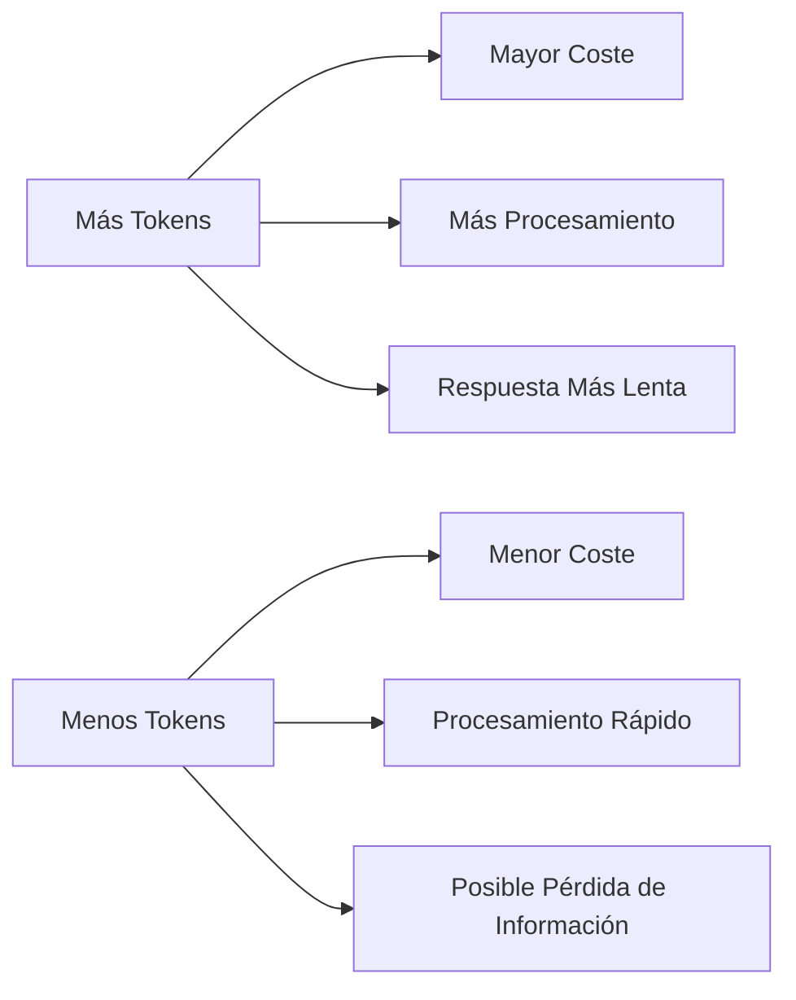
```mermaid
graph LR
    A[Más Tokens] --> B[Mayor Coste]
    A --> C[Más Procesamiento]
    A --> D[Respuesta Más Lenta]
    
    E[Menos Tokens] --> F[Menor Coste]
    E --> G[Procesamiento Rápido]
    E --> H[Posible Pérdida de Información]
```

**Enlaces**

- [Tokenizacion](https://www.datacamp.com/es/blog/what-is-tokenization)
- [Contador de tokens](https://platform.openai.com/tokenizer)

---

## 5. Contexto y Ventana de Contexto

### 5.1 Context window: ventana de contexto

La **ventana de contexto** es como la memoria a corto plazo del modelo. Es la cantidad máxima de información que puede "recordar" en una conversación.

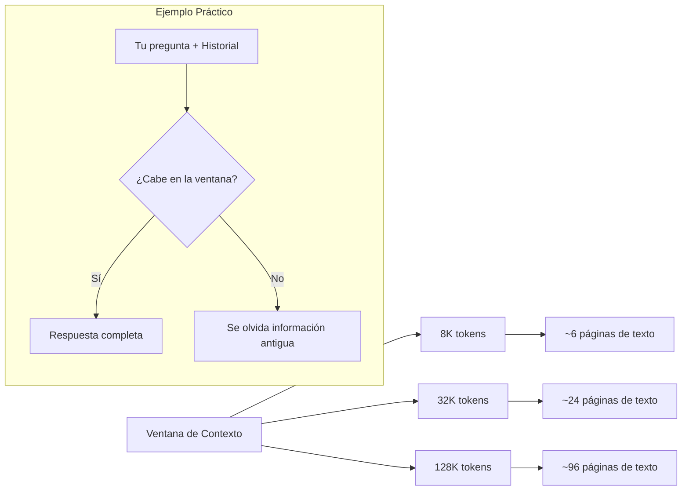
```mermaid
graph LR
    A[Ventana de Contexto] --> B[8K tokens]
    A --> C[32K tokens]
    A --> D[128K tokens]
    
    B --> B1[~6 páginas de texto]
    C --> C1[~24 páginas de texto]
    D --> D1[~96 páginas de texto]
    
    subgraph "Ejemplo Práctico"
        E[Tu pregunta + Historial] --> F{¿Cabe en la ventana?}
        F -->|Sí| G[Respuesta completa]
        F -->|No| H[Se olvida información antigua]
    end
```

### 5.2 Cómo afecta a coherencia y capacidad de "recordar"

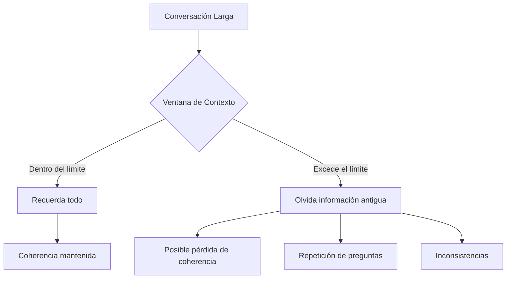
```mermaid
flowchart TD
    A[Conversación Larga] --> B{Ventana de Contexto}
    B -->|Dentro del límite| C[Recuerda todo]
    B -->|Excede el límite| D[Olvida información antigua]
    
    C --> E[Coherencia mantenida]
    D --> F[Posible pérdida de coherencia]
    D --> G[Repetición de preguntas]
    D --> H[Inconsistencias]
```

### 5.3 Técnicas para gestionar contexto

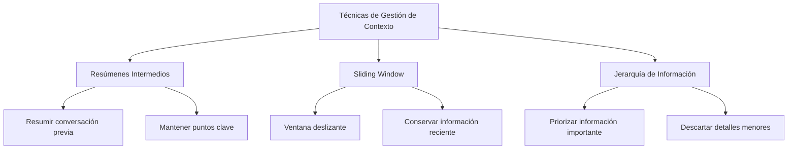
```mermaid
graph TD
    A[Técnicas de Gestión de Contexto] --> B[Resúmenes Intermedios]
    A --> C[Sliding Window]
    A --> D[Jerarquía de Información]
    
    B --> B1[Resumir conversación previa]
    B --> B2[Mantener puntos clave]
    
    C --> C1[Ventana deslizante]
    C --> C2[Conservar información reciente]
    
    D --> D1[Priorizar información importante]
    D --> D2[Descartar detalles menores]
```

**Enlaces para profundizar:**

- [Creacion de prompts](https://www.promptingguide.ai/es/introduction/basics)

---

## 6. La API de OpenAI: Visión General

### 6.1 Endpoints disponibles

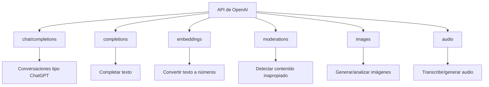
```mermaid
graph TD
    A[API de OpenAI] --> B[chat/completions]
    A --> C[completions]
    A --> D[embeddings]
    A --> E[moderations]
    A --> F[images]
    A --> G[audio]
    
    B --> B1[Conversaciones tipo ChatGPT]
    C --> C1[Completar texto]
    D --> D1[Convertir texto a números]
    E --> E1[Detectar contenido inapropiado]
    F --> F1[Generar/analizar imágenes]
    G --> G1[Transcribir/generar audio]
```

### 6.2 Autenticación y seguridad

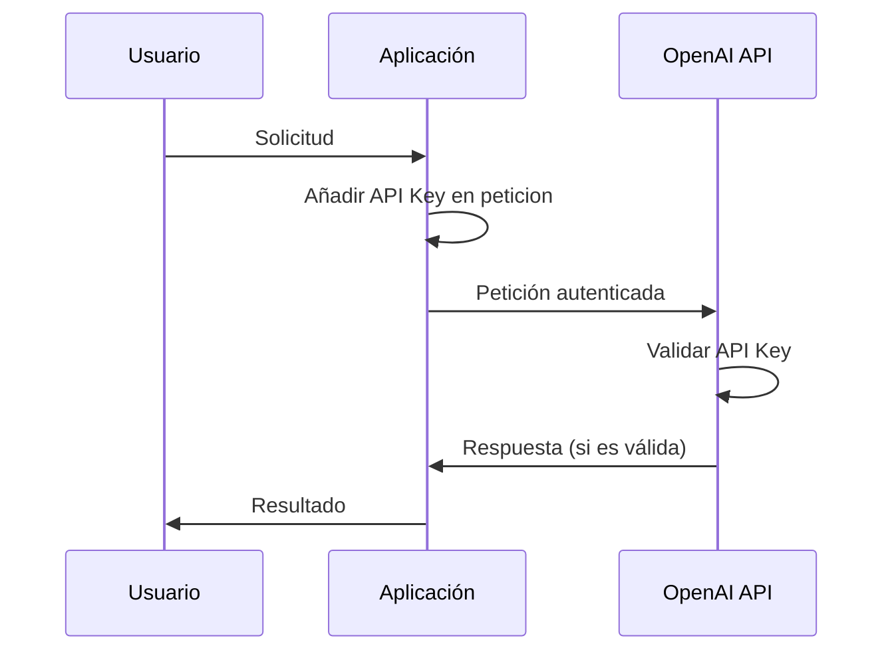
```mermaid
sequenceDiagram
    participant U as Usuario
    participant A as Aplicación
    participant O as OpenAI API
    
    U->>A: Solicitud
    A->>A: Añadir API Key en peticion
    A->>O: Petición autenticada
    O->>O: Validar API Key
    O->>A: Respuesta (si es válida)
    A->>U: Resultado
```

### 6.3 Formato de petición

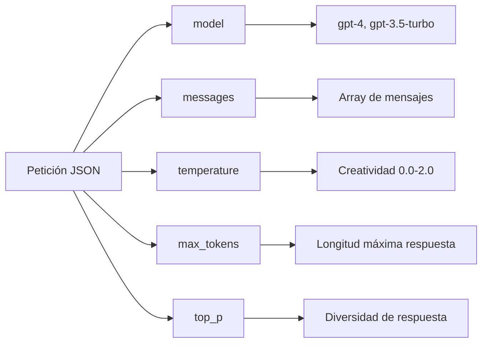
```mermaid
graph LR
    A[Petición JSON] --> B[model]
    A --> C[messages]
    A --> D[temperature]
    A --> E[max_tokens]
    A --> F[top_p]
    
    B --> B1[gpt-4, gpt-3.5-turbo]
    C --> C1[Array de mensajes]
    D --> D1[Creatividad 0.0-2.0]
    E --> E1[Longitud máxima respuesta]
    F --> F1[Diversidad de respuesta]
```

### 6.4 Flujo de respuesta

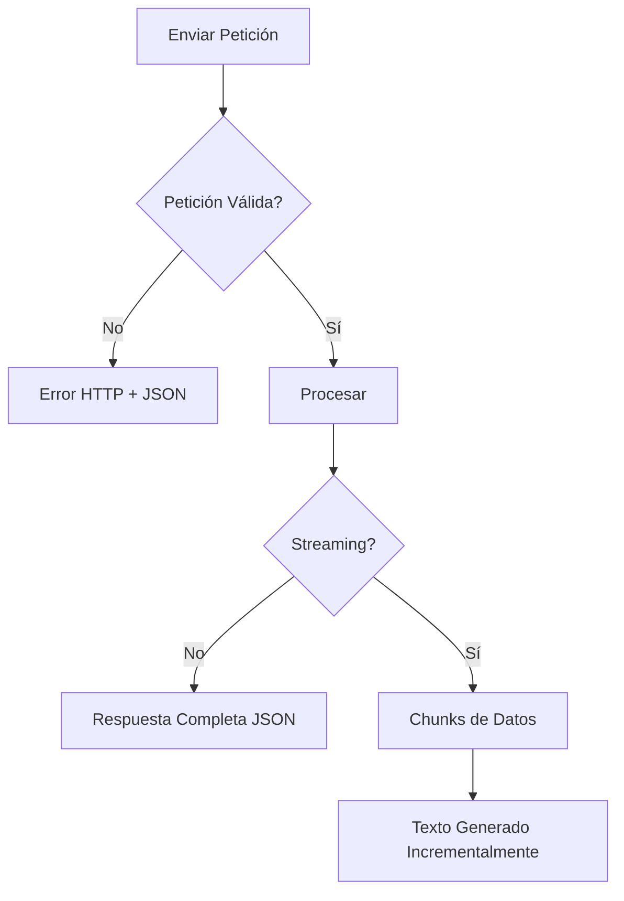
```mermaid
flowchart TD
    A[Enviar Petición] --> B{Petición Válida?}
    B -->|No| C[Error HTTP + JSON]
    B -->|Sí| D[Procesar]
    D --> E{Streaming?}
    E -->|No| F[Respuesta Completa JSON]
    E -->|Sí| G[Chunks de Datos]
    G --> H[Texto Generado Incrementalmente]
```

### 6.5 Ejemplo de Respuesta
```json
{
  "id": "resp_67ccd2bed1ec8190b14f964abc0542670bb6a6b452d3795b",
  "object": "response",
  "created_at": 1741476542,
  "status": "completed",
  "error": null,
  "incomplete_details": null,
  "instructions": null,
  "max_output_tokens": null,
  "model": "gpt-4.1-2025-04-14",
  "output": [
    {
      "type": "message",
      "id": "msg_67ccd2bf17f0819081ff3bb2cf6508e60bb6a6b452d3795b",
      "status": "completed",
      "role": "assistant",
      "content": [
        {
          "type": "output_text",
          "text": "In a peaceful grove beneath a silver moon, a unicorn named Lumina discovered a hidden pool that reflected the stars. As she dipped her horn into the water, the pool began to shimmer, revealing a pathway to a magical realm of endless night skies. Filled with wonder, Lumina whispered a wish for all who dream to find their own hidden magic, and as she glanced back, her hoofprints sparkled like stardust.",
          "annotations": []
        }
      ]
    }
  ],
  "parallel_tool_calls": true,
  "previous_response_id": null,
  "reasoning": {
    "effort": null,
    "summary": null
  },
  "store": true,
  "temperature": 1.0,
  "text": {
    "format": {
      "type": "text"
    }
  },
  "tool_choice": "auto",
  "tools": [],
  "top_p": 1.0,
  "truncation": "disabled",
  "usage": {
    "input_tokens": 36,
    "input_tokens_details": {
      "cached_tokens": 0
    },
    "output_tokens": 87,
    "output_tokens_details": {
      "reasoning_tokens": 0
    },
    "total_tokens": 123
  },
  "user": null,
  "metadata": {}
}
```

---

## 7. Parámetros y Control de Salida

### 7.1 Temperature y aleatoriedad

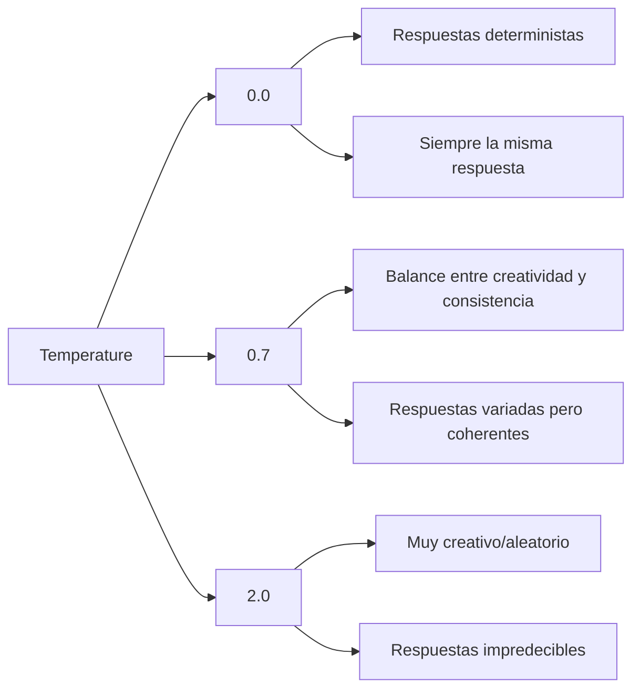
```mermaid
graph LR
    A[Temperature] --> B[0.0]
    A --> C[0.7]
    A --> D[2.0]
    
    B --> B1[Respuestas deterministas]
    B --> B2[Siempre la misma respuesta]
    
    C --> C1[Balance entre creatividad y consistencia]
    C --> C2[Respuestas variadas pero coherentes]
    
    D --> D1[Muy creativo/aleatorio]
    D --> D2[Respuestas impredecibles]
```

### 7.2 Top_p (nucleus sampling)

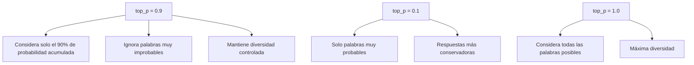
```mermaid
graph TD
    A[top_p = 0.9] --> B[Considera solo el 90% de probabilidad acumulada]
    A --> C[Ignora palabras muy improbables]
    A --> D[Mantiene diversidad controlada]
    
    E[top_p = 0.1] --> F[Solo palabras muy probables]
    E --> G[Respuestas más conservadoras]
    
    H[top_p = 1.0] --> I[Considera todas las palabras posibles]
    H --> J[Máxima diversidad]
```

### 7.3 Otros parámetros importantes

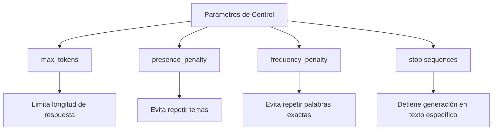
```mermaid
graph TD
    A[Parámetros de Control] --> B[max_tokens]
    A --> C[presence_penalty]
    A --> D[frequency_penalty]
    A --> E[stop sequences]
    
    B --> B1[Limita longitud de respuesta]
    C --> C1[Evita repetir temas]
    D --> D1[Evita repetir palabras exactas]
    E --> E1[Detiene generación en texto específico]
```


**Enlaces**

- [Parameter Guide - OpenAI](https://platform.openai.com/docs/api-reference/chat/create)

---

## 8. Gestión de Costes y Rate Limits

### 8.1 Cálculo de coste por token

```mermaid
graph LR
    A[Coste Total] --> B[Tokens de Entrada]
    A --> C[Tokens de Salida]
    
    B --> B1[Precio por 1K tokens input]
    C --> C1[Precio por 1K tokens output]
    
    D[Ejemplo GPT-4] --> E[$0.03 / 1K tokens input]
    D --> F[$0.06 / 1K tokens output]
```

### 8.2 Límites de tasa (Rate Limits)

```mermaid
graph TD
    A[Rate Limits] --> B[RPM - Requests Per Minute]
    A --> C[TPM - Tokens Per Minute]
    A --> D[RPD - Requests Per Day]
    
    B --> B1[Número máximo de peticiones]
    C --> C1[Número máximo de tokens]
    D --> D1[Límite diario total]
    
    E[Exceder Límites] --> F[Error 429]
    F --> G[Reintentar después de espera]
```

### 8.3 Estrategias de optimización de coste

```mermaid
flowchart TD
    A[Optimización de Costos] --> B[Reducir Tokens]
    A --> C[Usar Modelos Apropiados]
    A --> D[Implementar Cache]
    
    B --> B1[Prompts más concisos]
    B --> B2[Limitar max_tokens]
    
    C --> C1[GPT-3.5 para tareas simples]
    C --> C2[GPT-4 solo cuando necesario]
    
    D --> D1[Guardar respuestas frecuentes]
    D --> D2[Evitar peticiones duplicadas]
```

**Enlaces**

- [OpenAI Precios](https://markovate.com/openai-llm-api-pricing-calculator/)
- [Rate Limits - OpenAI](https://platform.openai.com/docs/guides/rate-limits)
- [Calculadora de tokens](https://platform.openai.com/tokenizer)

---

## 9. Seguridad, Moderación y Privacidad

### 9.1 Filtrado de contenido sensible

```mermaid
graph TD
    A[Petición del Usuario] --> B[Moderations API]
    B --> C{¿Contenido Seguro?}
    C -->|Sí| D[Procesar con LLM]
    C -->|No| E[Rechazar/Filtrar]
    
    D --> F[Respuesta Generada]
    F --> G[Chequeo de respuesta]
    G --> H{¿Respuesta Segura?}
    H -->|Sí| I[Enviar al Usuario]
    H -->|No| J[Generar Respuesta Alternativa]
```

### 9.2 Almacenamiento seguro de datos

```mermaid
graph LR
    A[Seguridad de Datos] --> B[Encriptación]
    A --> C[Variables de Entorno]
    A --> D[Acceso Restringido]
    A --> E[Auditoría]
    
    B --> B1[HTTPS para transmisión]
    B --> B2[Seguridad de datos]
    
    C --> C1[API Keys no hardcodeadas]
    C --> C2[Configuración externa]
    
    D --> D1[Uso de privilegios]
    D --> D2[Autenticación]
    
    E --> E1[Logs de acceso]
    E --> E2[Monitoreo de uso y gastos]
```

---
## 10. Buenas Prácticas de Diseño de Prompts

### 10.1 Prompt engineering

```mermaid
graph TD
    A[Componentes de un Buen Prompt] --> B[Instrucciones Claras]
    A --> C[Contexto Relevante]
    A --> D[Ejemplos - Few-shot]
    A --> E[Formato de Salida]
    
    B --> B1[Usar verbos de acción específicos]
    B --> B2[Evitar ambigüedades]
    
    C --> C1[Proporcionar background necesario]
    C --> C2[Definir el rol del AI]
    
    D --> D1[Mostrar 2-3 ejemplos]
    D --> D2[Demostrar el patrón deseado]
    
    E --> E1[Especificar JSON, tabla, lista, etc.]
    E --> E2[Longitud aproximada]
```

### 10.2 Chain-of-thought prompting

```mermaid
flowchart TD
    A[Problema Complejo] --> B[Dividir en Pasos]
    B --> C[Paso 1: Identificar elementos clave]
    C --> D[Paso 2: Analizar relaciones]
    D --> E[Paso 3: Aplicar lógica]
    E --> F[Paso 4: Verificar resultado]
    F --> G[Respuesta Final]
    
    H[Prompt Chain-of-Thought] --> I["Piensa paso a paso..."]
    I --> J["Primero, identifica..."]
    J --> K["Luego, considera..."]
    K --> L["Finalmente, concluye..."]
```

### 10.3 Evaluación de salidas

```mermaid
graph LR
    A[Evaluación de Respuestas] --> B[Métricas Automáticas]
    A --> C[Revisión de Sistema]
    
    B --> B1[Longitud de respuesta]
    B --> B2[Coherencia sintáctica]
    B --> B3[Valides de Respuesta]
    
    C --> C1[Validez SQL]
    C --> C2[Permisos]
```

**Enlaces**
- [Partes de un prompt](https://www.youtube.com/watch?v=kgBZhJnh-vk)
- [Consejos para diseño de prompts](https://www.promptingguide.ai/es/introduction/tips)

---

## 11. Manejo de concurrencia y retries

```mermaid
flowchart TD
    A[Petición Entrante] --> B[Envio]
    B --> C{Procesamiento}
    C -->|Sí| D[Ejecucion]
    C -->|No| E[Reintento]
    
    D --> F{¿Éxito?}
    F -->|Sí| G[Respuesta al Usuario]
    F -->|No| H{¿Reintentar?}
    H -->|Sí| I[Reintento de Ejecucion]
    I --> D
    H -->|No| J[Error al Usuario]
    
    K[Rate Limit Hit] --> L[Pausa Calculada]
    L --> M[Reintento Automático]
```


---

## 12. Monitorización y Evaluación Continua

### 12.1 Logging de peticiones/respuestas

```mermaid
graph TD
    A[Petición Usuario] --> B[Log Request]
    B --> C[Procesar con AI]
    C --> D[Log Response]
    D --> E[Análisis de Logs]
    
    B --> B1[Timestamp]
    B --> B2[User ID]
    
    D --> D1[Response Time]
    D --> D2[Token Count]
    D --> D3[Cost Calculation]
    D --> D4[Success/Error Status]
```

### 12.2 Métricas clave

```mermaid
graph LR
    A[Metricas Importantes] --> B[Técnicas]
    A --> C[Negocio]
    A --> D[Usuario]
    
    B --> B1[Latencia]
    B --> B2[Tasa de Error]
    B --> B4[Disponibilidad]
    
    C --> C1[Coste por Petición]
    C --> C3[Volumen de Uso]
```