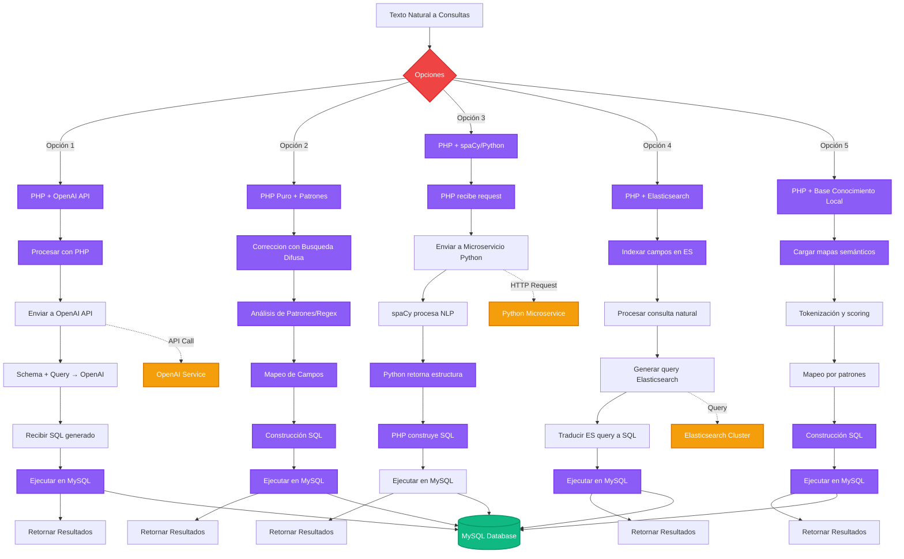
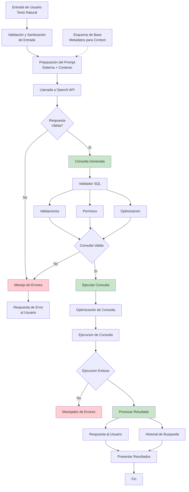
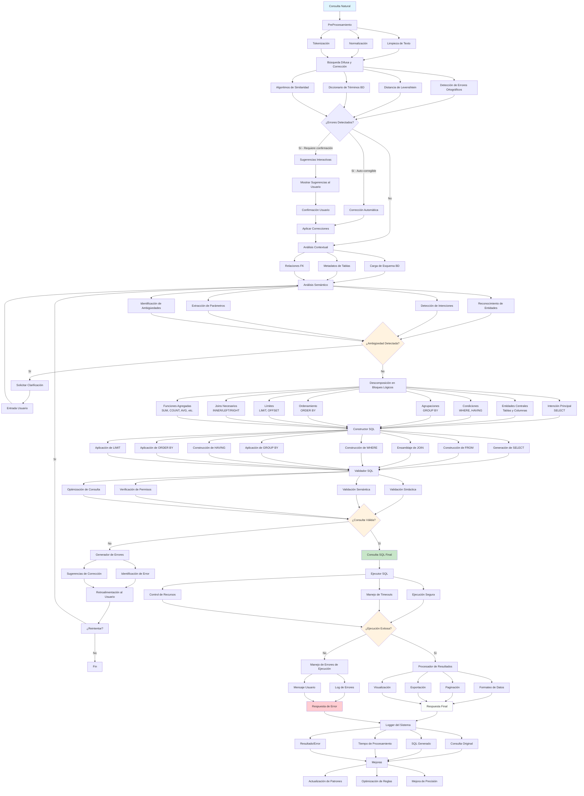
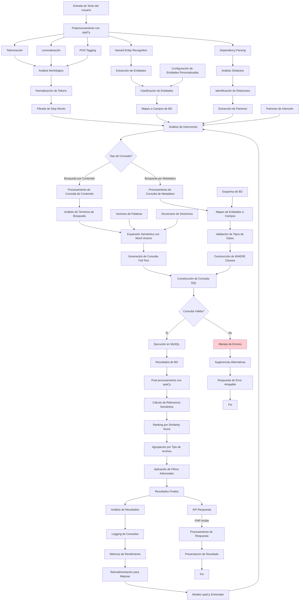
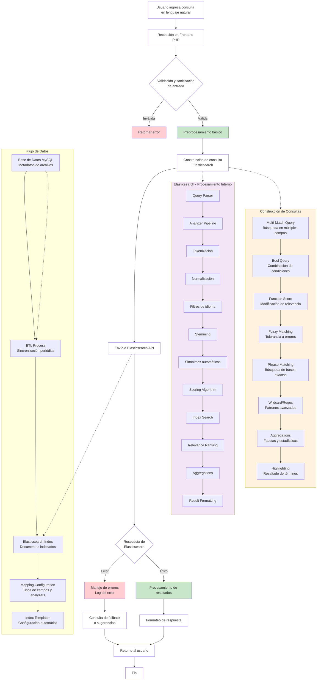
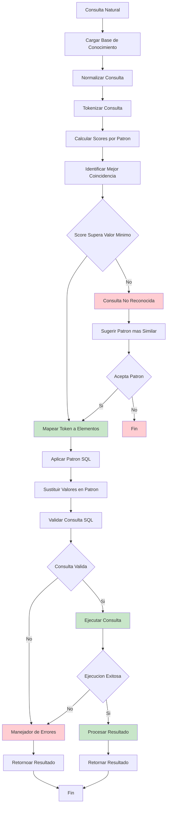
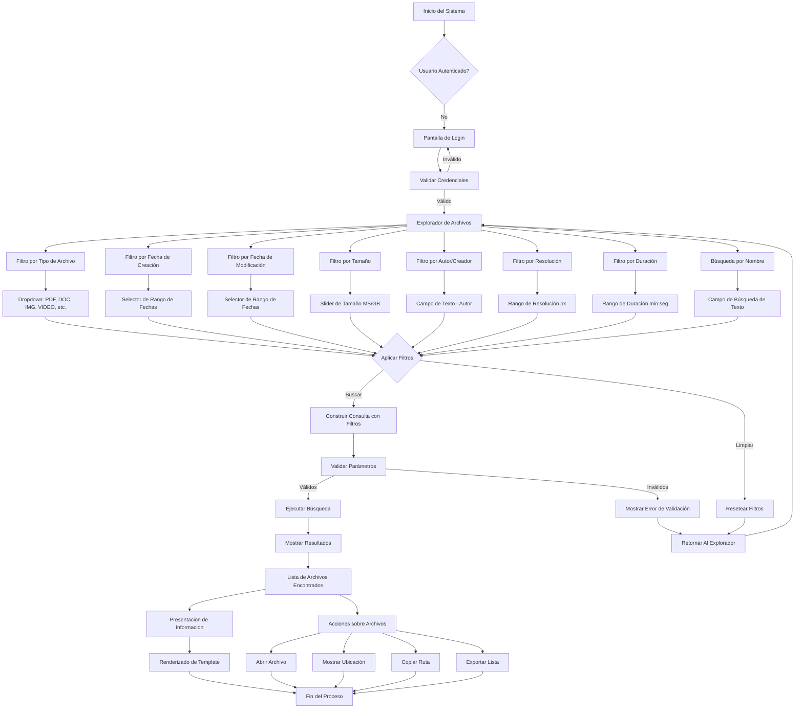
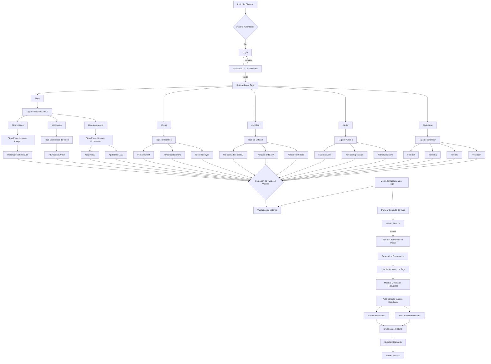

# Opciones
Ideas generales de flujo de trabajo:

## Opcion 1: PHP + OpenAI API
Proceso general:

### Consideraciones:
- Seguridad:
	- Implementacion de white list de comandos.
	- Uso de usuario con permiso a solo consultas.
	- Usar consultas preparadas para evitar inyecciones SQL.
- Logs:
	- Errores de consultas con el prompt y la consulta creada.
	- Medicion de operaciones.
- Costos(aproximados o estimados):
	- GPT-4o:
		- $5 USD por 1M tokens de entrada
		- $20 USD por 1M tokens de salida
	- GPT-4mini:
		- $0.15 USD por 1M tokens de entrada
		- $0.60 USD por 1M tokens de salida
	- Estimacion de tokens por consulta:
		- Prompt + Esquema DB : ~500 tokens
		- Busqueda de Usuario: ~50 - 200 tokens
		- Respuesta estructurada: ~100 - 300 tokens
		- Total: ~650 - 1000 tokens por consulta
Suponiendo que se realizan 100 consultas por dia:
- GPT4o: $19-30 USD por mes
- GPT4o mini: $0.60 - $0.90 USD por mes

### Pros
- Flexibilidad: Maneja variaciones naturales del lenguaje de forma robusta
- Comprension Contextual: Entiende intenciones complejas y mejor manejo de ambigüedades en las busquedas
- Mantenimiento: menos mantenimiento
- Capacidades avanzadas: Puede sugerir alternativas, reformular consultas y optimizarlas
### Contras
- Costos: Cada consulta tiene un costo en tokens, puede ser significativo dependiendo del numero de consultas
- Dependencia externa: Requiere conexion a interner y disponibilidad del servicio de la API de OpenAI
- Latencia: Las llamadas a la API pueden tener mayor tiempo de respuesta dependiendo de la conexion
- Menor control: si no se controla el prompt puede generar respuestas impredecibles
- Complejidad en el manejo de respuesta: manejo de errores para validar respuestas no validas
### Opción 2: PHP + Patrones
Proceso general:

### Componentes Principales:
- Busqueda Difusa
	- Resuelve problemas gramaticales
	- Corrige errores de escritura
- Analizador de Intenciones
	- Detecta el tipo de consulta(SELECT,WHERE,LIMIT,etc)
	- Extrae entidades y parametros
	- Detecta ambiguedad o contradicciones
- Constructor de Consultas
	- Crea la consulta a en base al Analizador de Intenciones
	- Verifica y valida Consultas
	- Ejecuta la Consulta.
- Logger
	- Errores
	- Consultas fallidas
	- Busquedas con consulta generada.
	- Base para mejoras en las reglas y diccionarios.

### Consideraciones:
Creación de diccionarios para optimización del Analizador
- Diccionario de Intenciones 
	- SELECT = "listame, quiero, dame, busco,etc"
	- WHERE = "donde,que,con,mayor que, entre"
- Diccionario de entidades
	- Campos = "usuario, area, producto, cliente"
- Diccionario de parametros
	- temporales = "mes pasado, este mes, entre la fecha, día"
	- tipo = "pdf,documento,facturas,etc"
- Diccionario de sinonimos
	- factura = "documento, cuenta,etc"
	- producto = "articulos, items, mercancias, etc"
El Analizador depende de los diccionarios o registros para su funcion y necesitan ser constantemente actualizados o mantenidos haciendo uso de los logs.

### Pros
- Arquitectura estructurada
- Control total y local
- Mantenibilidad Mejorada
- Rendimiento optimizado
- Seguridad Robusta
- Sin Costos
### Contras
- Trabajo Manual en construccion de diccionarios
- Dificultad con variaciones no previstas
- Crecimiento lento y manual, necesidad de acutalizar diccionarios manuelmente
- Complejidad

## Opcion 3: PHP + spaCy/Python

### Consideraciones
- Se necesita un servido o Microservicio dedicado a spaCy que procese la busqueda
- Agrega complejidad
- Se necesita mas configuraciones mas complejas
- Creación de codigo Python para manejar las solicitudes
- Mantenimiento de codigo extra

### Pros
- Robusto: Gran manejo de lenguaje natutal
- Mayor Comprension: Entiende contextos y relaciones semanticas
- Escalable: Se adapta a nuevas formas de expresion en busquedas automaticamente
### Contras
- Complejidad alta: integracion del servicio, configuracion y crear una API para conexion con PHP
- Recursos: mayor consumo de recursos de CPU y memoria
- Dependencia: Se requiere mantener y verificar el entorno de Python, se depende que este funcione
- Configuracion: Configuracion compleja de infraestructura y personalizacion
## Opcion 4: PHP + Elasticsearch

### Concideraciones
- Infraestructura adicional, se tiene que agregar el servicio de Elasticsearch
- Buen escalado pero agrega costo de rendimiento para consultas simples o peticiones bajas
- Se necesita indexar las tablas de la base de datos a Elasticsearch
- Para indexar debe ser de forma manual y actualizarse con cada nuevo registro en la base

### Pros
- Potencia: maneja de forma automatica tokenizacion, stemming, sinonimos, busqueda difusa y scoring
- Escalabilidad: diseñado para grandes volumenes de datos y consultas concurrentes
- Flexibilidad: maneja multiples idiomas y variaciones naturales de texto
- Catacteristicas avanzadas:  autocompletado, correcciòn ortografica, búsqueda semántica, etc.
### Contras
- Complejidad en la infraestructura: requiere instalar, configurar y mantener el servicio 
- Aprendizaje: se necesita aprender conceptos de elasticsearch como mappings, analyzers, queries DSL, etc
- Recursos: consume mas memoria  y CPU que mysql
- Sincronizacion: se necesita mantener los datos sincronizados entre mysql y elasticsearch de forma constante
- Costo: en caso de necesitar licencia empresarial, aunque este caso puede no ser necesario

## Opcion 5: PHP + Base de Conocimiento Local

### Componentes
- Mapas Semanticos
	- Se crean mapas semanticos para cada tabla, operacion y patron posible
	- Formato Json/XML
- Sistema de Puntuacion
	- Evalua la consulta y la puntua de acuerdo a las coincidencias de los mapas semanticos
	- Selecciona el patron con mayor puntuacion
	- Sustituye los valores por defecto en los patrones por los de busqueda

### Pros
- Sin dependecias
- Los Datos sensibles estan en local
- Personalizable
- Sin costo
### Contras
- Desarrollo laborioso
- Limitado solo a patrones creados
- Requiere muchas pruebas
- Escalado muy lento y manual

## Opciones Basicas
### UI Tradicional

### Sistema de Tags

## Orden de Recomendación
Si se quiere un buscador con texto natural:
1. Opción 1 uso de OpenAI API
2. Opción 2 PHP puro
3. Opción 4 PHP + Elasticsearch
4. Opción 3 PHP + spaCy/Python
5. Opción 5 PHP + Base Conocimiento Local

Si se usa un enfoque mas basico de tipo filtro
1. Tags
2. UI tradicional