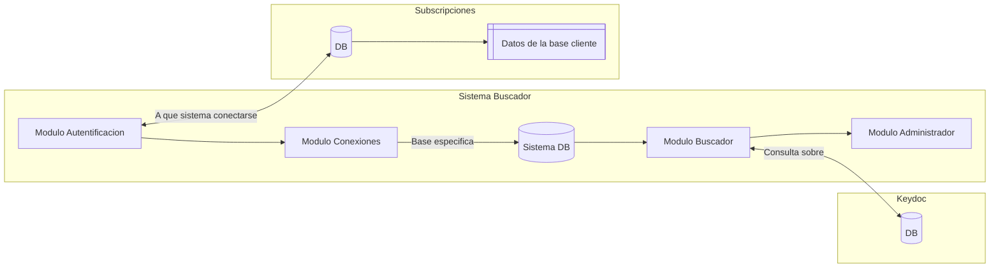
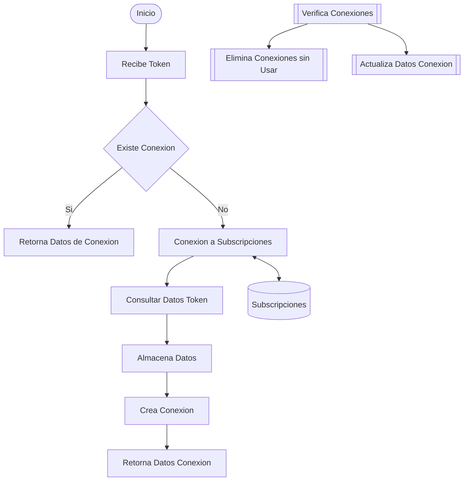
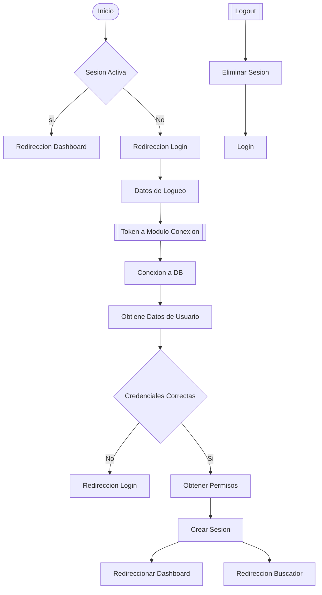
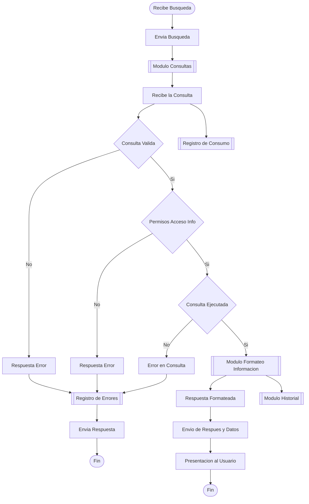

# Estructura General.
## Vision General.

## Modulos - Componentes del sistema.
### Autentificacion.
#### Funciones:
- Login.
- Logout.
- Crear Sesion.
- Cerrar Sesion.
- Validar Credenciales.
- Verificar Roles.
- Obtener datos de conexion.

### Conexion.
#### Funciones:
- Crear Conexiones.
- Validar Conexiones.
- Actualizar Conexiones.
- Eliminar Conexiones sin usar.

### Buscador.
#### Funciones:
- Conectar con Keydoc.
- Enviar busqueda a IA.
- Ejecutar Consulta.
- Validar Consulta.
- Recibir datos de consulta.
- Formatear Datos de acuerdo a la consulta.
- Presentar los al usuario.
- Registrar historial de busquedas.
- Historial de busquedas.
### Administrador.
#### Funciones:
- Registrar consumo de tokens.
- Restringir uso de consultas.
- Verificar disponibilidad de tokens.
- Analisis de consumo.

### Roles y Permisos.
#### Funciones:
- Crear Roles.
- Definir Permisos.
- Verificar permisos.
- Permisos a nivel sistema.
- Permisos de acceso a la informacion.
- Asignar roles y permisos.

---
## Modulo Conexion.

## Modulo Autentificacion.

## Modulo Buscador.

